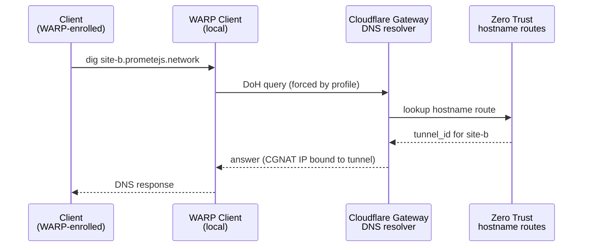
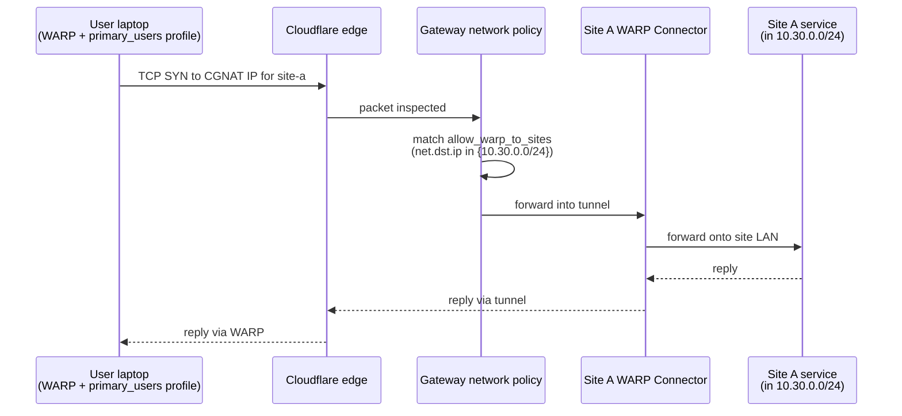
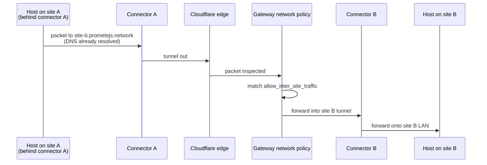
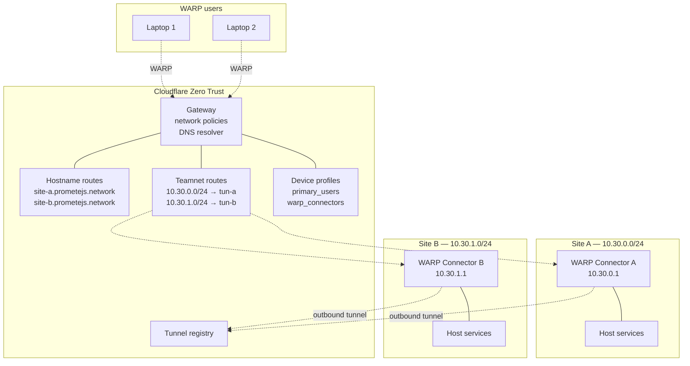

# Architecture

## Overview

A Cloudflare Zero Trust mesh network where each physical or cloud site runs a
WARP Connector that registers its subnet with Cloudflare. Sites reach each
other — and are reachable from WARP-enrolled user devices — by private
hostname. No public IPs, no site-to-site VPN, no hub-and-spoke concentrator.

Three things make the mesh work:

1. **WARP Connector tunnels** on each site terminate into Cloudflare's edge.
2. **Teamnet routes** tell Cloudflare "CIDR X belongs on tunnel Y."
3. **Private DNS hostname routes** bind a FQDN to a tunnel, resolvable only
   through Cloudflare Gateway.

Human users install the WARP client and match a device profile that forces
their DNS through Gateway, at which point they can resolve and reach any site
by name.

## Components

### Cloudflare Zero Trust

- **What:** Cloudflare's account-level security & networking plane.
- **Does:** Hosts the tunnel registry, teamnet route table, Gateway DNS
  resolver, Gateway network policies, device profiles.
- **Why:** Replaces the traditional VPN concentrator. Every site connects
  outbound to Cloudflare's edge; there is no public attack surface on the
  sites themselves.
- **Interacts with:** Everything in this system is a child of the Zero Trust
  account. The `cloudflare_account_id` variable is passed into every module.

### WARP Connector (per site)

- **What:** A Cloudflare-provided binary (`cloudflare-warp` in connector
  mode) running on a host inside the site's subnet.
- **Does:** Opens an outbound encrypted tunnel to Cloudflare. Accepts traffic
  from Cloudflare destined for its advertised CIDR and forwards it onto the
  local network.
- **Why:** Unlike the older `cloudflared` tunnel (which is hostname/ingress
  oriented), a WARP Connector advertises a whole subnet. That is what enables
  CIDR-level routing between sites.
- **Interacts with:**
  - Terraform creates the `cloudflare_zero_trust_tunnel_warp_connector`
    resource and exposes a registration token via the
    `cloudflare_zero_trust_tunnel_warp_connector_token` data source.
  - Ansible installs the binary on the site host and registers it using that
    token (sourced from state via the `cloud.terraform.terraform_provider`
    inventory plugin).
  - Once registered, the connector is how all inbound traffic from
    Cloudflare reaches the site's subnet.

### Teamnet routes (CIDR advertisement)

- **What:** Entries in Cloudflare's internal routing table that map a CIDR to
  a tunnel UUID.
- **Does:** Tell Cloudflare Gateway, "packets destined for `10.10.0.0/24`
  should be sent into tunnel `<uuid>`."
- **Why:** Without these, Cloudflare knows the tunnel exists but has no idea
  which subnet lives behind it.
- **Interacts with:** Created per site by
  `cloudflare_zero_trust_tunnel_cloudflared_route` in
  `modules/site-connector/main.tf`. The resource name is a legacy artifact —
  the underlying Cloudflare API endpoint (`/accounts/:id/teamnet/routes`) is
  tunnel-type-agnostic, so this resource works against WARP Connector tunnels
  too.

### Private DNS (hostname routes)

- **What:** `cloudflare_zero_trust_network_hostname_route` resources that
  bind a FQDN (e.g. `dev-site-a.dev.prometejs.network`) to a specific tunnel.
- **Does:** When a WARP-enrolled client queries Cloudflare Gateway DNS for
  that hostname, Gateway returns an address that routes traffic into the
  tunnel. The name is **not published on any public DNS zone.**
- **Why:** Replaces the previous design's public `<site>.internal` A record,
  which leaked site names on the public Cloudflare zone. Hostname routes are
  the v5 provider's purpose-built mechanism for private internal DNS — no
  on-prem resolver, no split-horizon, no zone pollution.
- **Interacts with:** One per site, alongside the tunnel and route. Devices
  resolve these only when they are (a) WARP-enrolled and (b) matched to a
  device profile that routes DNS through Gateway.

### Gateway network policies

- **What:** L4 allow-rules in `modules/zero-trust-policies/main.tf`.
- **Does:**
  - `${env}-allow-inter-site-traffic` — allow traffic between any two site
    CIDRs.
  - `${env}-allow-warp-to-sites` — allow WARP client traffic into any site
    CIDR.
- **Why:** Gateway defaults to deny-by-default for traffic steered through
  it. Without these rules, even with working tunnels and DNS, packets would
  be dropped by Gateway inspection.
- **Interacts with:** Keyed on CIDRs (not tunnel IDs), so they survive tunnel
  rotation unchanged. Dynamically built with
  `join(" or ", [for name, cidr in var.site_cidrs : "net.dst.ip in {${cidr}}"])`.

### Device profiles

Two `cloudflare_zero_trust_device_custom_profile` resources:

- **`warp_connectors`** (connector pseudo-user)
  - Matches `warp_connector@cloudflareaccess.com`.
  - Keeps the connector devices themselves from trying to proxy their own
    traffic back through Cloudflare (which would loop).
- **`primary_users`** (human users)
  - Match: `identity.email matches ".*@${var.user_email_domain}$"`.
  - `service_mode_v2 = { mode = "warp" }` — full WARP + Gateway, DNS goes
    through Cloudflare resolver (this is what makes the private hostnames
    resolve).
  - `allow_mode_switch = false` — user can't flip to "1.1.1.1 only" mode
    which would bypass Gateway DNS.
  - `disable_auto_fallback = true` — WARP won't silently fall back to the
    system resolver.
  - `switch_locked = true` — user can't disable WARP.
  - Excludes `100.96.0.0/12` (CGNAT) only — site CIDRs are deliberately NOT
    excluded so that traffic to them enters the tunnels.

### WARP client (user device)

- **What:** The end-user Cloudflare WARP application.
- **Does:** Enrolls the device into the Zero Trust organisation, receives
  the matched device profile, tunnels DNS and traffic through Cloudflare
  Gateway.
- **Why:** The only way a user can resolve and reach private site hostnames.
  A device without WARP sees `NXDOMAIN` for `*.prometejs.network` — the
  hostnames are strictly private.
- **Interacts with:** Users install WARP, log in, are auto-matched to
  `primary_users`, and can now `dig site-a.prometejs.network` and curl
  services in `10.30.0.0/24`.

### Terraform state + Ansible inventory bridge

- **What:** `ansible_host.site` and `ansible_group` resources from the
  `ansible/ansible` provider, written into Terraform state.
- **Does:** Serialises a dynamic inventory (hostname, SSH target,
  `tunnel_token`, `site_cidr`, `private_hostname`, `ha_enabled`, `ha_peer_ip`,
  `remote_cidrs`, `environment`) as structured state.
- **Why:** Terraform is the source of truth for which sites exist and their
  registration tokens. Exporting a file would create drift; reading state
  directly eliminates it.
- **Interacts with:** The `cloud.terraform.terraform_provider` Ansible
  inventory plugin reads the S3 state file and materialises Ansible hosts
  and groups from these resources at playbook runtime.

## Request flow

Two canonical flows matter: **site → site** and **user → site**. They share
the same DNS resolution path; they differ in who originates the query.

### DNS resolution

Key point: the answer IP is a Cloudflare-managed CGNAT address. It has no
meaning outside the WARP tunnel. A non-WARP device asking a public resolver
for the same name gets `NXDOMAIN`.

### User → site (e.g. `curl http://site-a.prometejs.network`)

### Site A → site B (inter-site)

No public IP is ever traversed. Both legs of the path are encrypted WARP
tunnels terminated on Cloudflare's edge.

## Architecture diagrams

### High-level topology

### Deployment pipeline

```mermaid
flowchart LR
    A[PR opens] --> B[plan.yml<br/>pull_request]
    B --> C[Checkov<br/>fmt/validate<br/>dflook plan comment]
    C --> D[PR sticky comment]
    D --> E[Merge to main]
    E --> F[Operator dispatch<br/>apply.yml]
    F --> G[plan.yml<br/>workflow_call]
    G --> H[terraform plan -out]
    H --> I[Upload tfplan.binary artifact]
    I --> J[apply job<br/>environment: workspace]
    J --> K[download artifact]
    K --> L[detect-new-sites.sh]
    L --> M[terraform apply tfplan.binary]
    M --> N[(S3 state<br/>+ ansible_host)]
    M --> O[summary job<br/>if: always]
    O --> P[Job Summary<br/>+ annotations]
    N --> Q[Ansible run]
    Q --> R[cloud.terraform.<br/>terraform_provider plugin]
    R --> S[Install/register<br/>WARP Connector on hosts]
```

## Design decisions

### Why WARP Connector instead of cloudflared

`cloudflared` is ingress-oriented — it publishes specific hostnames/ports
from a single origin. For a site-to-site mesh we need subnet-level
advertisement, which is exactly what WARP Connector provides. A previous
iteration of this repo ran `cloudflared` tunnels with a `curl` PATCH hack to
flip `tunnel_type` to `warp_connector` after creation; that workaround is
gone now that the v5 provider ships a native
`cloudflare_zero_trust_tunnel_warp_connector` resource.

### Why Cloudflare WARP at all

- **No public ingress.** Every connector dials out; site firewalls stay
  closed.
- **Unified identity plane.** User access, device posture, Gateway policies,
  and tunnel routing all live in the same account and cross-reference each
  other natively.
- **Encrypted by default, no key management.** The control plane handles
  rotation, connector auth, and session keys.
- **Mesh without a hub.** Every site is equidistant from every other site at
  Cloudflare's edge.

### Why split Terraform and Ansible

- **Terraform** is the right tool for declarative API state: Cloudflare
  resources, registration tokens, DNS records, routes. It is wrong for
  imperative host provisioning.
- **Ansible** is the right tool for "SSH to the connector host, install the
  package, write the config, enable the systemd unit." It is wrong for
  managing cloud resources.
- The bridge is the Terraform state file, read via the
  `cloud.terraform.terraform_provider` inventory plugin. No intermediate
  inventory file, no sync job, no drift.

### Why DNS-based service routing

- **Stable.** Service names don't change when a connector host is replaced
  or an IP shifts inside the subnet.
- **Discoverable.** The convention `<site-name>.<suffix>` is grep-able,
  obvious, and mirrors the Terraform site names exactly.
- **Private.** Hostname routes only resolve over WARP+Gateway. The same name
  on a non-WARP device returns `NXDOMAIN`. No accidental leakage.
- **Tunnel-bound, not host-bound.** A hostname route points at a tunnel, not
  an IP. The tunnel covers the whole subnet, so the name reaches anything on
  the site LAN. Fine-grained per-host DNS (if ever needed) is an in-site
  concern handled by Ansible, not Terraform.

### Per-environment DNS suffixes

`dev` uses `dev.prometejs.network`; `prod` uses `prometejs.network`. Dev and
prod run in the same Cloudflare account but with fully isolated private
namespaces — a dev device can never accidentally resolve a prod hostname,
and vice versa.

### Rolling per-site prod cutovers

Changing Terraform resource types forces destroy+create, which rotates the
tunnel ID and registration token. For prod, the expected procedure is to
`-target=module.site[\"<name>\"]` one site at a time from a local workspace,
re-running the Ansible onboard playbook between each, so only one site is
offline at a time. The `apply.yml` workflow deliberately does not expose a
`-target` input — this is a manual escape hatch, not a normal operation.
