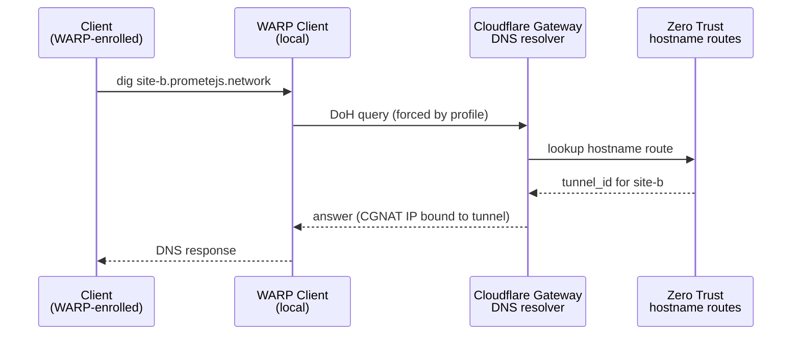
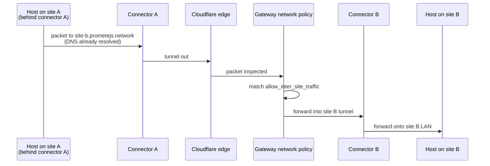

A Cloudflare Zero Trust any-to-any mesh network that uses WARP Connectors at each physical or virtual site to advertise local IPv4/IPv6 subnets to the Cloudflare global network. This creates secure, bidirectional site-to-site and client-to-site connectivity via private IP routing. 

Three things make the mesh work:

1. **WARP Connector tunnels** on each site terminate into Cloudflare's edge.
2. **Teamnet routes** tell Cloudflare "CIDR X belongs on tunnel Y."
3. **Private DNS hostname routes** bind a FQDN to a tunnel, resolvable only through Cloudflare Gateway.
  
## Components

### Cloudflare Zero Trust

- **What:** Cloudflare's account-level security & networking plane.
- **Does:** Hosts the tunnel registry, teamnet route table, Gateway DNS resolver, Gateway network policies, device profiles.
- **Why:** Replaces the traditional VPN concentrator. Every site connects outbound to Cloudflare's edge; limited to none public attack surface on the sites themselves.

### WARP Connector (per site)

- **What:** A Cloudflare-provided binary (`cloudflare-warp` in connector mode) running on a host inside the site's subnet.
- **Does:** Opens an outbound encrypted tunnel to Cloudflare. Accepts traffic from Cloudflare destined for its advertised CIDR and forwards it onto the local network.
- **Why:** Unlike the older `cloudflared` tunnel (which is hostname/ingress oriented), a WARP Connector advertises a whole subnet. That is what enables CIDR-level routing between sites.

### Teamnet routes (CIDR advertisement)

- **What:** Entries in Cloudflare's internal routing table that map a CIDR to a tunnel UUID.
- **Does:** Tell Cloudflare Gateway, "packets destined for `10.10.0.0/24` should be sent into tunnel `<uuid>`."
- **Why:** Without these, Cloudflare knows the tunnel exists but has no idea which subnet lives behind it.

### Private DNS (hostname routes)

- **What:** cloudflare_zero_trust_network_hostname_route resources bind a private FQDN to a specific tunnel.
- **Does:** Cloudflare Gateway DNS resolves these hostnames exclusively for WARP clients, routing traffic through the tunnel without exposing names to public DNS.
- **Why:** Replaces insecure public DNS records with a native, private internal DNS mechanism that eliminates public leaks, on-premise resolvers, and split-horizon configurations.

### Gateway network policies

- **What:** Layer 4 firewall allow-rules configured in `modules/zero-trust-policies/main.tf`.
- **Does:** 
  - `${env}-allow-inter-site-traffic` — allow traffic between any two site CIDRs.
  - `${env}-allow-warp-to-sites` — allow WARP client traffic into any site CIDR (Not In Context).
- **Why:** Gateway defaults to deny-by-default for traffic steered through it. Without these rules, even with working tunnels and DNS, packets would be dropped by Gateway inspection.

### Device profiles

- **`warp_connectors`** profile: Matches `warp_connector@cloudflareaccess.com` service accounts. It disables traffic proxying for connector nodes to prevent routing loops.
- **`primary_users`** profile: Matches human users via .*@${var.user_email_domain}$. It enforces full WARP/Gateway mode (service_mode_v2 = "warp") to ensure private hostname resolution. Locks client settings (allow_mode_switch = false, switch_locked = true) and disables auto-fallback to prevent users from bypassing Gateway DNS. Excludes only CGNAT ranges (100.96.0.0/12), deliberately retaining internal site CIDRs within the tunnel path.

### Terraform state + Ansible inventory bridge

- **What:** `ansible_host.site` and `ansible_group` resources from the `ansible/ansible` provider, written into Terraform state.
- **Does:** Serialises a dynamic ansible inventory as structured state.
- **Why:** Terraform is the source of truth for which sites exist and their registration tokens. Exporting a file would create drift; reading state directly eliminates it.

## Design decisions
Geared towards a site-to-site mesh for which we need subnet-level advertisement, and completely eliminates the need for public IP exposure, legacy site-to-site VPN tunnels, and centralized hub-and-spoke hardware concentrators.

### Why Warp Connector?

- [Meets design requirements](#design-decisions)
- **No public ingress.** Every connector dials out; site firewalls stay closed.
- **Unified identity plane.** User access, device posture, Gateway policies, and tunnel routing all live in the same account and cross-reference each other natively.
- **Encrypted by default, no key management.** The control plane handles rotation, connector auth, and session keys.
- **Mesh without a hub.** Every site is equidistant from every other site at Cloudflare's edge.

### Why Not cloudflared?

`cloudflared` is ingress-oriented and publishes specific hostnames/ports from a single origin. 

### Why split Terraform and Ansible

- **Terraform** is the right tool for declarative API state: Cloudflare resources, registration tokens, DNS records, routes. It is wrong for imperative host provisioning.
- **Ansible** is the right tool for "SSH to the connector host, install the package, write the config, enable the systemd unit." It is wrong for managing cloud resources.
- The bridge is the Terraform state file, read via the `cloud.terraform.terraform_provider` inventory plugin. No intermediate inventory file, no sync job, no drift.

### Why DNS-based service routing

- **Stable.** Service names don't change when a connector host is replaced or an IP shifts inside the subnet.
- **Discoverable.** The convention `<site-name>.<suffix>` is grep-able, obvious, and mirrors the Terraform site names exactly.
- **Private.** Hostname routes only resolve over WARP+Gateway. The same name on a non-WARP device returns `NXDOMAIN`. No accidental leakage.
- **Tunnel-bound, not host-bound.** A hostname route points at a tunnel, not an IP. The tunnel covers the whole subnet, so the name reaches anything on the site LAN.

### Per-environment DNS suffixes

`dev` uses `dev.prometejs.network`; `prod` uses `prometejs.network`. Allows fully isolated private namespaces on the same Cloudflare account.

## Request flow

Two canonical flows matter: **site → site** and **DNS resolution**. 

### DNS resolution

Key point: the answer IP is a Cloudflare-managed CGNAT address. It has no meaning outside the WARP tunnel. A non-WARP device asking a public resolver for the same name gets `NXDOMAIN`.

### Site → site 

## Caveats

Changing Terraform resource types forces a destructive replacement, rotating the tunnel ID and token. Production migration requires targeting one site at a time locally (`-target=module.site[\"<name>\"]`) and running the Ansible playbook sequentially to prevent simultaneous outages. The apply.yml workflow excludes -target to ensure this manual escape hatch is not automated.