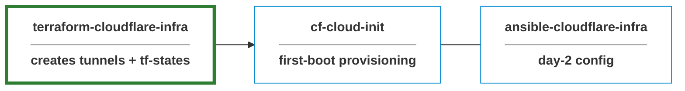
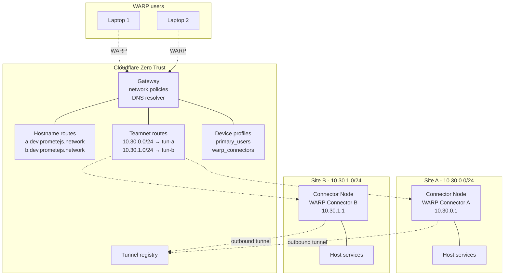
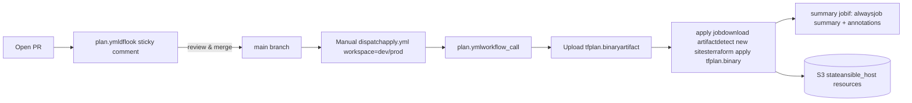

# terraform-cloudflare-infra

Terraform-managed Cloudflare Zero Trust site-to-site network.

### Key features

- **Private networking via Cloudflare**: no public IPs, VPN concentrators, or hub-site hairpinning
- **DNS-based service discovery**: `site-a.<suffix>` resolves only for WARP-enrolled users; traffic routes to the site's tunnel automatically
- **Terraform-managed**: all Cloudflare resources declarative, planned on PRs, applied via workflow dispatch
- **State-sourced Ansible inventory**: single source of truth between Terraform and Ansible
- **CI/CD guardrails**

## Part of a larger stack

This repo provisions the **Cloudflare side** of the mesh only in site-to-site stack, see [notes](./NOTES.md) for more info. A new site is brought online by three repos working in order:



#### Network topology



## Setup Requirements

### Tooling

| Tool | Version |
|---|---|
| Terraform | `>= 1.8.0` |
| Cloudflare provider | `~> 5.17` (tested on 5.18.0) |
| Ansible provider (`ansible/ansible`) | `~> 1.3` |
| Random provider | `~> 3.6` |
| Ansible core | `>= 2.15` |
| Ansible collection | `cloud.terraform` (for the `terraform_provider` inventory plugin) |

### Accounts

- **Cloudflare**: Zero Trust enabled. API token scoped to: `Account:Cloudflare Tunnel:Edit`, `Account:Zero Trust:Edit`, `Account:Access:Apps and Policies:Edit`, `Zone:DNS:Edit`
- **AWS**: S3 bucket + DynamoDB table for Terraform state (S3 backend with DynamoDB locking)

### Environment configuration

Create `dev` and `prod` environments in repo Settings → Environments, then set the following at the **environment** level:

| Secrets | Variables |
|---|---|
| `CLOUDFLARE_API_TOKEN` | `CLOUDFLARE_ACCOUNT_ID` → `TF_VAR_cloudflare_account_id` |
| `AWS_ACCESS_KEY_ID` | `CLOUDFLARE_ZONE_ID` → `TF_VAR_cloudflare_zone_id` |
| `AWS_SECRET_ACCESS_KEY` | |

## Ansible inventory contract

The root module does not emit an `ansible_inventory` output. Instead it creates resources from the `ansible/ansible` provider that the inventory plugin reads from Terraform state.

## Usage

### Local plan (read-only, dev)

```bash
export CLOUDFLARE_API_TOKEN=...
export AWS_ACCESS_KEY_ID=...
export AWS_SECRET_ACCESS_KEY=...
export TF_VAR_cloudflare_account_id=...
export TF_VAR_cloudflare_zone_id=...

terraform init
terraform workspace select -or-create=true dev
terraform plan -var-file=environments/dev.tfvars
```

### Deployment



- **dev:** Actions → **Terraform Apply** → Run workflow → workspace `dev`
- **prod:** same, workspace `prod`. The apply pauses for required reviewers configured on the `prod` environment.
- **Staged single-site cutover:** run locally with `terraform apply -target=module.site[\"<name>\"]` against the prod workspace. `apply.yml` does not expose a `-target` input.

### Testing

see [fixtures](./fixtures/test.tfvars) for sample data

## License

MIT — see [LICENSE.md](./LICENSE.md).