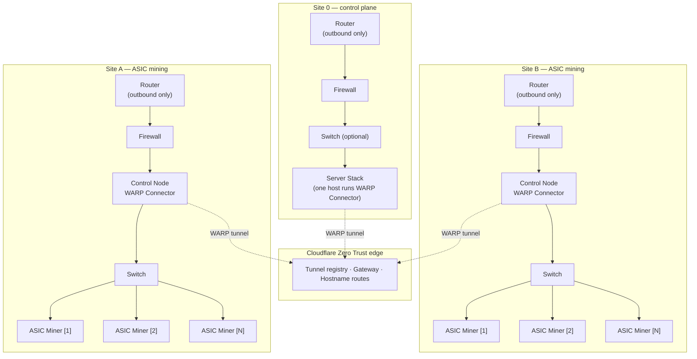
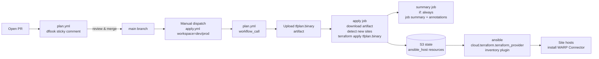

# terraform-cloudflare-infra

Terraform-managed Cloudflare Zero Trust site-to-site network. Each site runs a
**WARP Connector** tunnel that advertises its subnet into Cloudflare's private
network; sites reach each other via private DNS names resolved through
Cloudflare Gateway. Host-side provisioning of the connectors is handled by
Ansible, which sources its inventory directly from the Terraform state file.

## Part of a larger stack

This repo provisions the **Cloudflare side** of the mesh only. A new site is
brought online by three repos working in order:

| Repo | Role |
|---|---|
| [`cf-cloud-init`](../cf-cloud-init) | NoCloud cloud-init that installs the WARP Connector binary on a fresh Ubuntu host and provisions the `ansible` automation user |
| `terraform-cloudflare-infra` (this repo) | Cloudflare resources (tunnels, teamnet routes, private DNS, Gateway policies) + Terraform-state-backed Ansible inventory |
| [`ansible-cloudflare-infra`](../ansible-cloudflare-infra) | Playbooks that read this repo's state via `cloud.terraform.terraform_provider` and register each site's connector against its tunnel token |

Order of operations for a new site:
`cf-cloud-init` → `terraform-cloudflare-infra` → `ansible-cloudflare-infra`.

## Target network

The mesh provisioned here is designed for distributed ASIC-mining sites that
report into a central control-plane site. Every site is a flat L2 subnet with
one host (the **Control Node**) running the WARP Connector — that host is the
only thing this repo cares about per site; the rest of the LAN is opaque to
Cloudflare.



- Each site's CIDR is what this repo advertises as a teamnet route; the ASIC
  miners and Server Stack hosts sit inside that CIDR and are reachable
  transparently once the tunnel is up.
- Site 0 has no special hub role — to Cloudflare it's just another connector
  site. The mesh is flat; any site can reach any other site by its private
  hostname.
- The Control Node (or the designated Server Stack host on Site 0) is what
  `ansible-cloudflare-infra` targets, using the inventory it reads from this
  repo's Terraform state.

## What this repo does

- Provisions one `cloudflare_zero_trust_tunnel_warp_connector` per site
- Registers each site's CIDR as a teamnet route against its tunnel
- Publishes a private DNS hostname (`<site>.<private_dns_suffix>`) per site via
  `cloudflare_zero_trust_network_hostname_route` — resolvable only through
  Cloudflare Gateway (WARP)
- Creates Cloudflare Zero Trust Gateway network policies that permit
  inter-site traffic and WARP-client-to-site traffic
- Creates two device profiles: one for the connector pseudo-user, one for
  primary human users (email-domain match) forcing DNS resolution through
  Gateway
- Emits a structured `site_inventory` output plus `ansible_host` /
  `ansible_group` resources consumed by the
  `cloud.terraform.terraform_provider` Ansible inventory plugin, so `ansible`
  reads state directly — no static inventory files

## Key features

- **Private networking via Cloudflare** — no public IPs, no VPN concentrator,
  no hairpinning through a hub site
- **DNS-based service discovery** — `site-a.<suffix>` resolves only for
  WARP-enrolled users, traffic routes to the site's tunnel automatically
- **Terraform-managed** — all Cloudflare resources are declarative, planned on
  PRs, applied via workflow dispatch
- **State-sourced Ansible inventory** — one source of truth, no drift between
  what Terraform knows and what Ansible provisions
- **CI/CD guardrails** — PRs run `checkov` static analysis, `terraform fmt`,
  `terraform validate`, and post a `dflook/terraform-plan@v2` sticky comment.
  Apply runs gate on environment protection rules, detect new sites from the
  binary plan, and write a GitHub Job Summary with success/failure
  annotations and an onboarding reminder when new sites were created

## Requirements

| Tool / Account | Version / Scope |
|---|---|
| Terraform | `>= 1.8.0` |
| Cloudflare provider | `~> 5.17` (tested against 5.18.0) |
| Ansible provider (`ansible/ansible`) | `~> 1.3` |
| Random provider | `~> 3.6` |
| Ansible core | 2.15+ |
| Ansible collection | `cloud.terraform` (provides the `terraform_provider` inventory plugin) |
| Cloudflare account | Zero Trust enabled; API token scoped to `Account:Cloudflare Tunnel:Edit`, `Account:Zero Trust:Edit`, `Account:Access:Apps and Policies:Edit`, `Zone:DNS:Edit` |
| AWS | S3 bucket + DynamoDB table for Terraform state (backend is S3 with DynamoDB lock) |

### Required secrets (GitHub Actions)

Set these at the **environment** level (`dev`, `prod`) in repo Settings →
Environments:

| Secret | Purpose |
|---|---|
| `CLOUDFLARE_API_TOKEN` | Scoped Cloudflare API token |
| `AWS_ACCESS_KEY_ID` | S3 state backend access |
| `AWS_SECRET_ACCESS_KEY` | S3 state backend access |

### Required variables (GitHub Actions)

| Variable | Purpose |
|---|---|
| `CLOUDFLARE_ACCOUNT_ID` | Becomes `TF_VAR_cloudflare_account_id` |
| `CLOUDFLARE_ZONE_ID` | Becomes `TF_VAR_cloudflare_zone_id` |

### GitHub environments

Create `dev` and `prod` environments in repo Settings. The `plan.yml` and
`apply.yml` workflows bind their terraform-touching jobs to
`environment: <workspace>`, so protection rules (required reviewers, wait
timers) are enforced on `prod`.

## Project structure

```
.
├── terraform.tf             S3 backend, provider versions, provider config
├── variables.tf             Root variables (sites map, DNS suffix, email domain)
├── main.tf                  Module wiring + ansible_host/ansible_group resources
├── outputs.tf               site_inventory, site_names, site_cidrs, tunnel_ids
├── validations.tf           CIDR overlap and connector-IP preconditions
├── environments/
│   ├── dev.tfvars           dev workspace inputs
│   └── prod.tfvars          prod workspace inputs
├── modules/
│   ├── site-connector/      Per-site: WARP Connector tunnel + route + private DNS
│   └── zero-trust-policies/ Account-wide: gateway policies + device profiles
└── .github/
    ├── workflows/
    │   ├── plan.yml         PR plan (dflook sticky comment) + reusable workflow_call
    │   └── apply.yml        workflow_dispatch: plan → apply → job summary
    └── scripts/
        ├── detect-new-sites.sh    Parses binary plan, extracts new sites
        └── build-apply-summary.js Writes GitHub Job Summary + annotations
```

The `site-connector` module is instantiated via `for_each = var.sites` from
the root `main.tf`, so adding a site is a one-block edit in a tfvars file.

## Deployment flow



### Step-by-step

1. **PR opens** with a change under `*.tf`, `modules/**`, or `environments/*.tfvars`.
2. **`plan.yml`** triggers on `pull_request`. It runs Checkov → fmt → init →
   validate → `terraform workspace select dev` → `dflook/terraform-plan@v2`.
   The plan diff is posted as a sticky PR comment.
3. **Reviewer merges.**
4. **Operator dispatches `apply.yml`** with `workspace: dev` or `prod`.
5. `apply.yml` calls `plan.yml` as a reusable workflow (`workflow_call`) which
   runs `terraform plan -out=tfplan.binary` and uploads the binary as an
   artifact (`tfplan-<workspace>-<sha>.binary`).
6. The `apply` job downloads the artifact, runs `detect-new-sites.sh` to
   extract new site names for the summary, then applies the exact plan:
   `terraform apply -auto-approve -input=false tfplan.binary`. The apply job
   is bound to `environment: <workspace>`, so prod protection rules fire
   here.
7. Terraform writes updated state to S3, including:
   - `cloudflare_zero_trust_tunnel_warp_connector` resources and the
     `tunnel_token` data source values
   - **`ansible_host.site["<name>"]`** — one resource per site, carrying
     hostvars: `ansible_host`, `tunnel_token`, `site_cidr`, `private_hostname`,
     `ha_enabled`, `ha_peer_ip`, `environment`, `remote_cidrs`
   - **`ansible_group.connectors`** and **`ansible_group.environment`** —
     group membership hierarchy
8. The `summary` job runs with `if: always()` and writes a GitHub Job Summary
   (plan/apply result table, workspace, actor, run link) plus `core.warning` /
   `core.error` annotations. If new sites were created, it emits an
   `> [!IMPORTANT]` callout reminding the operator to run the Ansible
   onboarding playbook.
9. **Ansible** runs against the sites. The `cloud.terraform.terraform_provider`
   inventory plugin reads the S3 Terraform state file directly and materialises
   an inventory from the `ansible_host` / `ansible_group` resources — no static
   `hosts` file, no manual sync step. The playbook installs/registers the WARP
   Connector on each host using the `tunnel_token` hostvar.

### `ansible_inventory` contract (read this)

The root module does NOT emit a single `ansible_inventory` output; instead it
creates **Terraform resources from the `ansible/ansible` provider** that the
inventory plugin reads from state:

| Resource | Purpose |
|---|---|
| `ansible_group.connectors` | Flat group, all site hosts |
| `ansible_group.environment` | Group keyed by `terraform.workspace` (`dev` / `prod`), child of `connectors` |
| `ansible_host.site["<site-name>"]` | One per site; carries every hostvar Ansible needs |

To consume this from Ansible:

```yaml
# inventory.yml
plugin: cloud.terraform.terraform_provider
project_path: .        # path to the root module (or use state_file:)
```

Then:

```bash
ansible-inventory -i inventory.yml --list
ansible-playbook -i inventory.yml site-onboard.yml --limit environment_prod
```

## Usage

### Local plan (read-only, against dev)

```bash
export CLOUDFLARE_API_TOKEN=...
export AWS_ACCESS_KEY_ID=...
export AWS_SECRET_ACCESS_KEY=...
export TF_VAR_cloudflare_account_id=...
export TF_VAR_cloudflare_zone_id=...

terraform init
terraform workspace select -or-create=true dev
terraform plan -var-file=environments/dev.tfvars
```

### Trigger a deploy

- **To dev:** GitHub → Actions → **Terraform Apply** → Run workflow → workspace `dev`
- **To prod:** same, workspace `prod`. Apply will pause for any required
  reviewers configured on the `prod` environment. For staged cutovers of a
  single site, use a local `terraform apply -target=module.site[\"<name>\"]`
  against the prod workspace — `apply.yml` does not expose a `-target` input.

### Add a new site

1. Edit `environments/<workspace>.tfvars`:
   ```hcl
   sites = {
     ...existing...
     "dev-site-c" = {
       cidr         = "10.10.2.0/24"
       connector_ip = "10.10.2.1"
     }
   }
   ```
2. Open a PR. Review the dflook sticky comment.
3. Merge and dispatch `apply.yml`. The job summary will flag the new site.
4. Run the Ansible onboarding playbook against the new site to install the
   WARP Connector on the host.

## License

MIT — see [LICENSE.md](./LICENSE.md).
