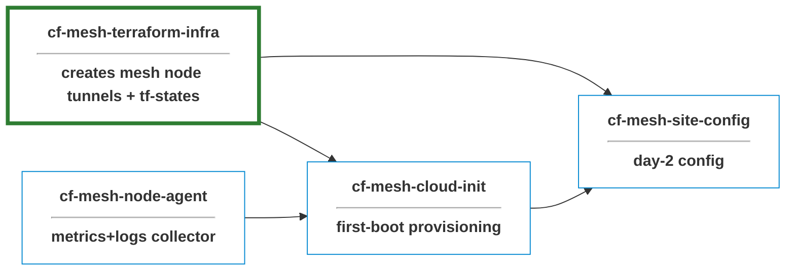

> **Rebrand note (April 2026):** Cloudflare renamed *WARP Connector* to **Cloudflare Mesh**, with each connector now referred to as a **mesh node** — see the [Cloudflare Mesh changelog](https://developers.cloudflare.com/changelog/post/2026-04-14-cloudflare-mesh/). The rebrand is non-breaking: existing deployments and resources keep working without migration.

# cf-mesh-terraform-infra

Terraform-managed dedicated **Cloudflare Mesh** network. **Cloudflare side** of a site-to-site provisioning stack.

#### Features

- **Private networking via Cloudflare**: no public IPs, VPN concentrators, or hub-site hairpinning
- **Terraform-managed**: all Cloudflare resources declarative, planned on PRs, applied via workflow dispatch
- **State-sourced Ansible inventory**: single source of truth between Terraform and Ansible via an _Ansible inventory contract_
- **CI guardrails**

see [notes](./NOTES.md) for more info.

## Setup Guide

### Tooling

| Tool | Required version |
|:---|:---|
| Terraform | >= 1.8.0 |
| Cloudflare provider	| ~> 5.17 (locked at 5.18.0) | 
| Ansible provider | 	~> 1.3 (locked at 1.4.0) |
| hashicorp/random provider	| ~> 3.6 (locked at 3.8.1) |
| hashicorp/null provider	| ~> 3.2 (locked at 3.2.4) |
| tflint	| latest (with terraform plugin, recommended preset, call_module_type = "local") |
| AWS CLI / credentials	| n/a — only static keys used	|

### Accounts

- **Cloudflare**: Zero Trust enabled. API token scoped to: `Account:Cloudflare Tunnel:Edit`, `Account:Zero Trust:Edit`, `Account:Access:Apps and Policies:Edit`, `Zone:DNS:Edit`
- **AWS**: S3 bucket + DynamoDB table for Terraform state (S3 backend with DynamoDB locking)

### Environment configuration (Per Environment)

| Name | Sensitive | Used for |
|:---|:---|:---|
| `CLOUDFLARE_API_TOKEN` | true | cloudflare provider token. Token must allow Zero Trust (gateway policies,  device profiles, virtual networks, tunnel routes), Cloudflare One Networks, Cloudflare One Connectors and Cloudflare One Connector: WARP. |
| `AWS_ACCESS_KEY_ID` | true  | Auth for the S3 backend |
| `AWS_SECRET_ACCESS_KEY` | true | Auth for the S3 backend |
| `CLOUDFLARE_ACCOUNT_ID` | false | Becomes TF_VAR_cloudflare_account_id |
| `CLOUDFLARE_ZONE_ID` | false | Becomes TF_VAR_cloudflare_zone_id (reserved for dns module only)|

###  Backend setup
terraform.tf declares an empty backend "s3" {}, which is filled in by per-environment files in environments/.

### Testing

see [fixtures](./fixtures/dev.tfvars) for sample data

## License

MIT - see [LICENSE.md](./LICENSE.md).
