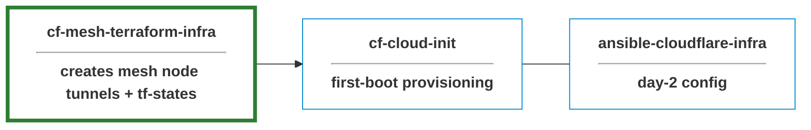
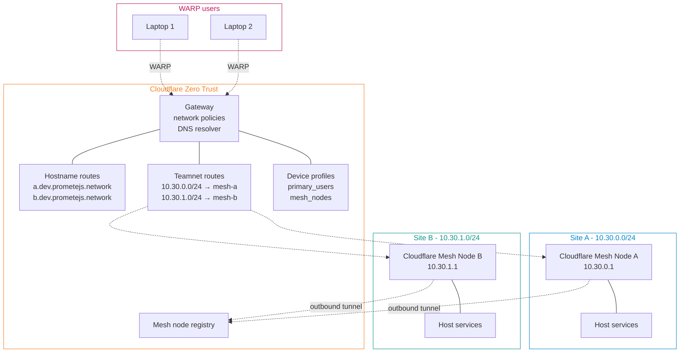

> **Rebrand note (April 2026):** Cloudflare renamed *WARP Connector* to **Cloudflare Mesh**, with each connector now referred to as a **mesh node** — see the [Cloudflare Mesh changelog](https://developers.cloudflare.com/changelog/post/2026-04-14-cloudflare-mesh/). The rebrand is non-breaking: existing deployments and resources keep working without migration.

# cf-mesh-terraform-infra

Terraform-managed dedicated **Cloudflare Mesh** network. **Cloudflare side** of a site-to-site provisioning stack.

#### Features

- **Private networking via Cloudflare**: no public IPs, VPN concentrators, or hub-site hairpinning
- **DNS-based service discovery**: `site-a.<suffix>` resolves only for WARP-enrolled users; traffic routes to the site's mesh node automatically
- **Terraform-managed**: all Cloudflare resources declarative, planned on PRs, applied via workflow dispatch
- **State-sourced Ansible inventory**: single source of truth between Terraform and Ansible via an _Ansible inventory contract_
- **CI/CD guardrails**

see [notes](./NOTES.md) for more info.

## Setup Requirements

### Tooling

| Tool | Version |
|---|---|
| Terraform | `>= 1.8.0` |
| Cloudflare provider | `~> 5.17` (tested on 5.18.0) |
| Ansible provider (`ansible/ansible`) | `~> 1.3` |
| Random provider | `~> 3.6` |
| Ansible core | `>= 2.15` |
| Ansible collection | `cloud.terraform` (for the `terraform_provider` inventory plugin) |

### Accounts

- **Cloudflare**: Zero Trust enabled. API token scoped to: `Account:Cloudflare Tunnel:Edit`, `Account:Zero Trust:Edit`, `Account:Access:Apps and Policies:Edit`, `Zone:DNS:Edit`
- **AWS**: S3 bucket + DynamoDB table for Terraform state (S3 backend with DynamoDB locking)

### Environment configuration

Create `dev` and `prod` environments in repo Settings → Environments, then set the following at the **environment** level:

| Secrets | Variables |
|---|---|
| `CLOUDFLARE_API_TOKEN` | `CLOUDFLARE_ACCOUNT_ID` → `TF_VAR_cloudflare_account_id` |
| `AWS_ACCESS_KEY_ID` | `CLOUDFLARE_ZONE_ID` → `TF_VAR_cloudflare_zone_id` |
| `AWS_SECRET_ACCESS_KEY` | |

#### Network topology

### Testing

see [fixtures](./fixtures/dev.tfvars) for sample data

## License

MIT — see [LICENSE.md](./LICENSE.md).

